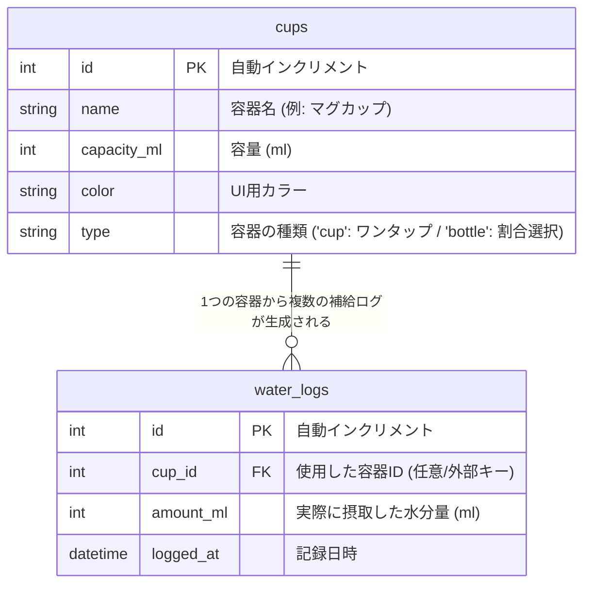

# Water Tracker

毎日の水分補給をワンタップで簡単に記録・習慣化するためのWebアプリケーションです。

## ターゲット層 & 開発背景

日常生活の中で「意識しないと水分補給を忘れてしまう」以下のようなユーザーをターゲットとしています。

1. **美容・健康意識が高い人**
   * 肌の乾燥予防、デトックス、代謝アップのために毎日「2Lの水分摂取」を目指しているが、一日でどれくらい飲めたか分からなくなる人。
2. **運動・スポーツ習慣がある人 / 熱中症対策をしたい人**
   * スポーツ、ジム、部活動などでこまめな水分補給が必要な人。
   * 夏場や運動時のパフォーマンス維持・熱中症予防のために、計画的かつ確実に水分量を記録・管理したい人。

### 解決する課題 💡
「わざわざ数値を手入力するのが面倒で続かない」という挫折を防ぐため、**“事前に設定したコップ・水筒をワンタップするだけ”** の最小限の操作性で、ストレスのない習慣化をサポートします。

## 機能一覧

### 基本機能 (MVP)
* **マイ容器管理:** よく使うコップや水筒（名前・容量・カラー・タイプ）の登録・一覧表示
* **スマート記録（容器タイプ別）:**
  * **コップ型:** ワンタップで指定容量を即時記録（何度でも可能）
  * **水筒型:** タップ時に本日の摂取割合（全飲み / 3/4 / 半分 / 1/4）を選択して記録。**記録後は当日グレーアウト（1日1回制限）**
* **目標進捗表示:** 本日の合計摂取量（ml）と目標達成ゲージの表示
* **補給履歴:** 過去の履歴参照

### 追加実装予定
* カスタム（手入力）記録機能（任意のmlを手入力）
* 過去の履歴をカレンダー・グラフなどで可視化

## データベース設計 (ER図)

